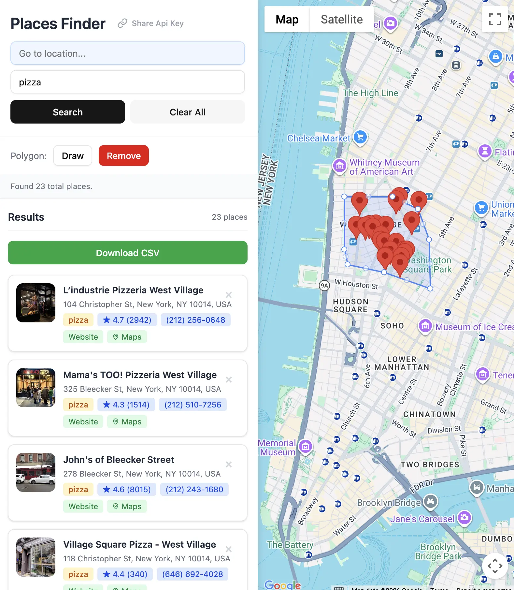

# Google Maps Places Finder

Draw a polygon on a map, search for places within it, build a list, and export to CSV.

**Live demo:** https://mapthing.vercel.app



## What It Does

1. **Draw a polygon** on Google Maps to define a search area
2. **Search for places** within that polygon (e.g. "coffee shops", "dentists", "gyms")
3. **Accumulate results** across multiple searches into a single list
4. **Export to CSV** for Google Sheets, Excel, or any CSV-compatible app

Each result includes: name, address, phone number, website, rating, and review count.

## Getting a Google API Key

You need a Google Cloud API key with the following APIs enabled:

1. Go to [Google Cloud Console](https://console.cloud.google.com/)
2. Create a new project (or select an existing one)
3. Navigate to **APIs & Services > Library**
4. Enable the following APIs:
   - **Maps JavaScript API**
   - **Places API**
5. Navigate to **APIs & Services > Credentials**
6. Click **Create Credentials > API Key**
7. Copy your key

**Recommended:** Restrict the key to your domain under **API restrictions** to prevent unauthorized use.

## Using Your API Key

### Option 1: Enter it in the app

Open the app and paste your key into the API Key field.

### Option 2: URL query parameter

Append `?apiKey=YOUR_KEY` to the URL:

```
https://your-app-url.com/?apiKey=AIzaSy...
```

The key is automatically saved to localStorage and removed from the URL bar.

### Option 3: Share / bookmark

Click the **Share Api Key** button in the app to copy a URL with your key embedded. Send it to teammates or bookmark it for quick access.

The key is stored in your browser's `localStorage` and never sent to any server.

## Running Locally

```bash
bun install
bun dev
```

Open [http://localhost:3000](http://localhost:3000).

## Building for Production

```bash
bun run build
bun start
```

## Tech Stack

- [Bun](https://bun.sh/) — runtime, bundler, package manager
- React 19
- Tailwind CSS
- Google Maps JavaScript API (Places, Drawing, Geometry libraries)
